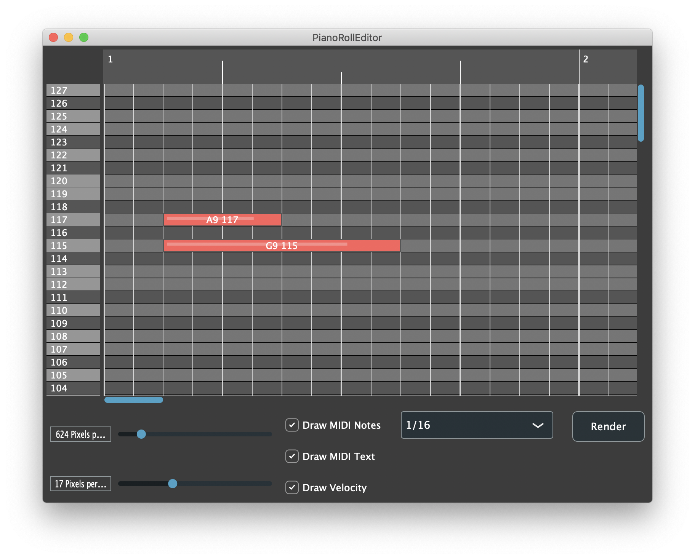

# Piano-Roll-Editor
A simple piano roll editor written in c++ using the JUCE framework for graphics

# Usage

Simple add the relevant files from the **source** folder to your JUCE project. The main.cpp, mainComponent.h and mainComponent.cpp are shown as examples of how to setup and use the various piano roll editor components. 

The notes are represented using the Sequence class. Use an instance of this class to load the piano roll editor. The NoteGridComponent returns an instance of Sequence to convert the position of each note on the roll back into a Sequence of notes. You could then pass this to a MIDI sequencer or similar (depending on your application)

# Versions 

Built and tested with JUCE v5.4.1 (OSX)
